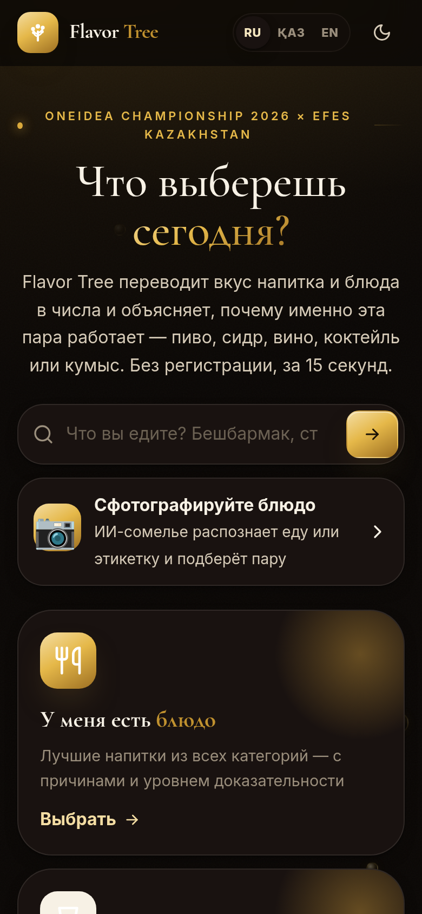
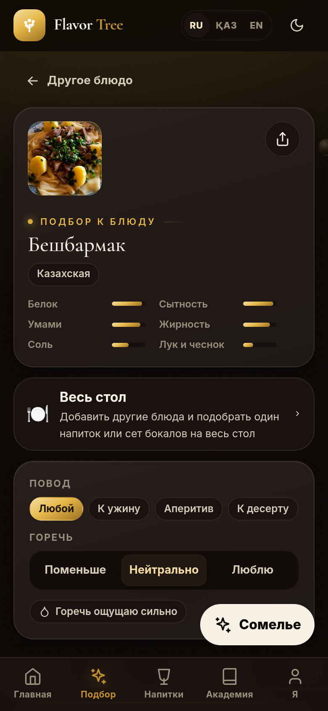
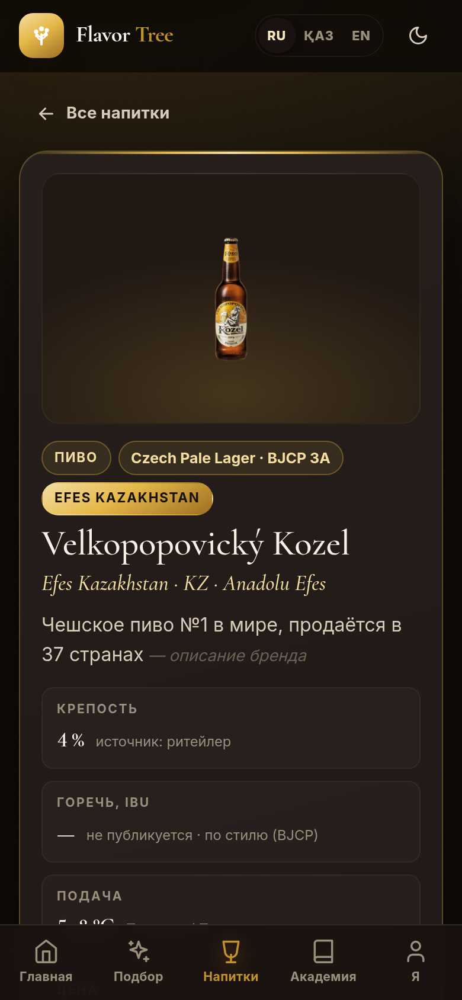
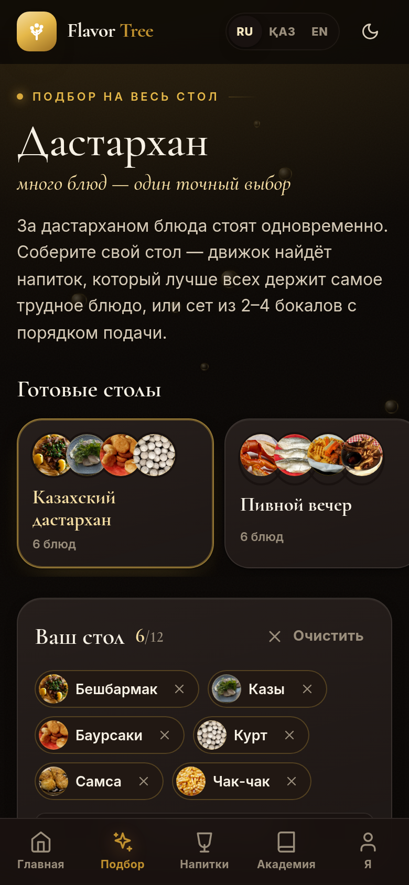

# Flavor Tree v2

> *«Don't just drink — listen to the flavor»*

Честный подбор напитка к еде для баров и ресторанов Казахстана. Гость сканирует QR на столе, выбирает блюдо и за
несколько секунд видит, что к нему взять, и главное — почему. Движок знает 412 напитков 17 категорий (пиво, сидр,
вино, игристое, коктейли, крепкое, квас, кумыс и айран, чай, кофе…) и 114 блюд — от бешбармака до тирамису.
Каждое объяснение опирается на учебники сомелье и сенсорные исследования, у каждой причины указан уровень
доказательности. Балл от бренда не зависит.

**OneIdea Championship 2026 × Efes Kazakhstan** · команда: Аджибаева Аделия, Абуталифулы Ералы

| Главная (телефон) | Результат подбора | Карточка напитка | Дастархан — весь стол |
|---|---|---|---|
|  |  |  |  |

---

## Что умеет

**Для гостя**
- **Подбор к блюду** — вкладки «Лучшее · Пиво · Без алкоголя · Сидр · Вино и игристое · Коктейли · Крепкое».
  У каждой пары — оценка, тип (очищает / дополняет / контраст / мост), до трёх причин с буквой доказательности
  (A — измерено в лаборатории, B — дегустационные панели, C — консенсус сомелье, D — гипотеза), предупреждения и
  полный разбор по правилам. Повод (к ужину, аперитив, жара, без алкоголя…), отношение к горечи, «люблю поострее».
- **Дастархан — подбор на весь стол** (`/table`) — до 12 блюд сразу. Движок ищет напиток, у которого самая слабая
  пара по столу сильнее, чем у любого другого (а не «в среднем неплохо»), или сет из 2–4 бокалов: у каждого блюда свой
  бокал и порядок подачи от тихого к громкому. Если хорошей пары на весь стол нет, так и пишем и показываем слабое
  место. Стол можно отправить картинкой для сторис с баллами движка.
- **Каталог напитков** — у каждого видно, откуда числа: этикетка, стиль BJCP или категория, и насколько профиль надёжен.
- **ИИ-сомелье** — сфотографировать блюдо или этикетку незнакомого напитка, спросить словами. ИИ переводит гостя на
  язык движка и обратно, а не «угадывает пиво»; профиль незнакомого напитка строит сервер и честно помечает, что
  прочитано на этикетке, а что предположено ([docs/AI.md](docs/AI.md)).
- **Отзывы** — оценка пары и метки («слишком горько», «перебивает блюдо»); метки меняют следующий подбор
  ([docs/REVIEWS.md](docs/REVIEWS.md)).
- Три языка: русский, казахский, английский — включая объяснения движка ([docs/ENGINE_TEXTS.md](docs/ENGINE_TEXTS.md)).

**Для заведения**
- Гостевое меню по QR/NFC: их цены, стоп-лист, подбор только из их карты, кнопка «Заказать».
- Кабинет: меню, столы и печать стендов, аналитика в ₸, отзывы гостей, **анализ карты** — какие напитки добавить,
  чтобы блюда получили пары лучше ([docs/SAAS.md](docs/SAAS.md)).

**Для Efes**
- **Радар портфеля** (`/insights`) — к каким блюдам Efes лучший выбор, где проигрывает и кому, какие стили закрыли бы
  больше блюд, карта вкусов всех напитков ([docs/INSIGHTS_EFES.md](docs/INSIGHTS_EFES.md)).
- **Аналитика портфеля** (`/brand`, вход по токену бренда) — что гостям показывают и что они заказывают, доля Efes
  «как показано» и «по честному баллу», эффект правила 2 баллов ([docs/EFES_ANALYTICS.md](docs/EFES_ANALYTICS.md)).

## Честность — как устроено

- **Баллы от бренда не зависят.** Правило Efes влияет только на порядок: если напиток Efes отстаёт не больше чем на
  2 балла, он стоит выше, и это помечено. Лучший напиток Efes показывается отдельно со своим настоящим баллом.
  Правило записано в каждом ответе API и проверяется тестом.
- **Числа напитков — из источников.** Крепость с этикетки или сайта, IBU от производителя, стиль по BJCP. Если данных нет,
  так и пишем («крепость не опубликована — принята по стилю») и снижаем уверенность профиля. Черновики и позиции
  с неподтверждённым наличием в подбор не попадают.
- **Эталон — мнения сомелье с цитатами.** 445 пар из BA, CMS, WSET, Cicerone, Wine Folly, Decanter, русскоязычных и
  казахстанских источников, у каждой — ссылка и дословная цитата ([docs/research/sommelier-sources-v2.md](docs/research/sommelier-sources-v2.md)).
  Движок проходит 357 из 445 и 104 из 115 отложенных пар.
- **Калибровку пробовали и не применили:** на отложенных парах подгонка не обыграла литературные значения
  ([docs/CALIBRATION_V2.md](docs/CALIBRATION_V2.md)).
- Фото блюд — только со свободными лицензиями, с автором и лицензией на странице «Источники»; иллюстрации напитков
  рисуются из их данных, чужие бутылки мы не фотографируем.

Подробнее: [docs/PAIRING_ENGINE_V2.md](docs/PAIRING_ENGINE_V2.md) — движок коротко, [docs/research/ENGINE_V2_SPEC.md](docs/research/ENGINE_V2_SPEC.md) —
спецификация с формулами, страница «Как мы считаем» (`/method`) — для жюри.

## Быстрый старт

### Фронтенд (Angular 18) — работает без бэкенда
```bash
cd frontend
npm install
npm start                 # http://localhost:4200
npm run build             # production → dist/frontend/browser (prebuild синхронизирует данные для Vercel)
```

### Бэкенд (Django 4.2 + DRF) — SQLite по умолчанию, PostgreSQL через `DATABASE_URL`
```bash
cd backend
python3 -m venv .venv && .venv/bin/pip install -r requirements.txt
cp .env.example .env                                  # ключи и токены — см. комментарии в файле
.venv/bin/python manage.py migrate
.venv/bin/python manage.py load_flavor_data           # данные v1 (сорта Efes, пирамиды) и заведения
.venv/bin/python manage.py seed_saas --events 420     # демо-заведения и кабинет (efes@demo.flavortree.kz / flavor2026)
.venv/bin/python manage.py runserver                  # http://127.0.0.1:8000/api/
```
Чтобы SPA работала через API (цены и стоп-лист из базы, отзывы, аналитика), задайте в `frontend/src/index.html`:
`<script>window.FT_API_URL = 'http://127.0.0.1:8000/api'</script>`.

Переменные: `ANTHROPIC_API_KEY` — ИИ-сомелье, `FT_ADMIN_TOKEN` — панель сомелье, `FT_BRAND_TOKEN` — аналитика Efes,
`DJANGO_SECRET_KEY`, `DJANGO_DEBUG=False`, `DJANGO_ALLOWED_HOSTS`, `CORS_ALLOWED_ORIGINS` — для прода
([BACKEND_DOCUMENTATION.md](BACKEND_DOCUMENTATION.md)).

### Данные
```bash
python3 scripts/build_catalog_v2.py     # каталог напитков из рыночных отчётов → data/drinks.json
python3 scripts/build_dishes_v2.py      # блюда → data/dishes_v2.json
python3 scripts/build_spa_data_v2.py    # лёгкий каталог и параметры для браузера
python3 scripts/build_insights_v2.py    # радар портфеля Efes → data/insights_v2.json
```

## Маршруты SPA

| Путь | Что |
|---|---|
| `/` | главная: поиск блюда, два входа (блюдо / напиток), факты |
| `/pair` → `/pair/:dish` | выбор блюда или «своё блюдо» → подбор с вкладками и разбором |
| `/drinks` → `/drinks/:id` | каталог напитков → карточка: профиль, откуда числа, источники, лучшие блюда |
| `/table` | дастархан: подбор на весь стол, готовые столы, сет бокалов, картинка для сторис |
| `/scan` | ИИ-сомелье: фото блюда или этикетки напитка |
| `/m/:бар/:стол`, `/qr/:токен` | гостевое меню заведения |
| `/cabinet` | кабинет заведения: меню, анализ карты, столы и QR, отзывы, аналитика |
| `/insights` | радар портфеля Efes |
| `/brand` | аналитика портфеля Efes (токен бренда; без сервера — помеченная демо-выгрузка) |
| `/method` | «Как мы считаем» — методика для жюри |
| `/credits` | источники фото и данных |
| `/beers`, `/academy`, `/dna`, `/admin`, `/business`, `/about` | пирамиды сортов Efes, школа сомелье, Flavor DNA, панель сомелье, лендинг для баров, о проекте |

## Проверка

```bash
cd backend && .venv/bin/python manage.py test api.tests          # весь бэкенд: движок, API, отзывы, ИИ, аналитика
python3 scripts/engine_eval_v2.py                                 # эталонные пары сомелье + golden для TypeScript
python3 scripts/check_engine_texts.py                             # переводы объяснений: баллы на kk/en те же
cd frontend && npm run build && npm run smoke                     # сборка и сквозные сценарии
npm run test:engine2 && npm run test:optimizer && npm run test:table   # паритет с Python, анализ карты, дастархан
node scripts/ai-dryrun.mjs && npx tsc -p tsconfig.api.json        # ИИ-сомелье без ключа
```

## Структура

```
data/          каталог (drinks, style_priors_v2, dishes_v2), эталон (test_pairs, classic_pairs), параметры движка,
               переводы текстов, радар Efes, демо-выгрузка аналитики; data/research — предложения и кандидаты
scripts/       сборка данных, оценка и калибровка движка, фото блюд, радар
backend/       Django API · api/pairing/engine_v2.py — движок · views_engine_v2, views_reviews, views_tracking, views_brand, ai
frontend/      Angular 18 · engine/pairing-engine-v2.ts — тот же движок · core/ · ui/ · pages/ · api/ — ИИ на Vercel
docs/          методика, API, отзывы, ИИ, аналитика, исследования (docs/research)
```

## Деплой

**Vercel (фронтенд):** Root Directory = `frontend`, Build Command `npm ci && npm run build`, Output `dist/frontend/browser`,
Environment Variables → `ANTHROPIC_API_KEY`. `frontend/vercel.json` содержит SPA-rewrite и функцию `/api/ai`.
**Бэкенд:** любой хостинг с Python; переменные из раздела «Быстрый старт».

## Что дальше

Дегустация с сомелье Efes по спорным парам и уточнение профилей сортов (IBU и техкарты), пилот в 2–3 заведениях
Алматы и первые отзывы гостей, повторная калибровка с балансировкой классов и новой отложенной выборкой. План до
финала — [PLAN.md](PLAN.md), сценарий демо и ответы на вопросы жюри — [docs/DEMO.md](docs/DEMO.md).

## Материалы OneIdea

`research.md` — CustDev (n=20) · `Flavor_Tree_Roadmap.pdf`, `GANTT.pdf`, `Lean Canvas.pdf`, `🍺 FLAVOR TREE.pdf` — питч-документы ·
`1 version/`, `2 version/`, `5 version/` — предыдущие итерации кода (архив).

---
*© 2026 Flavor Tree. OneIdea Championship · Efes Kazakhstan · Anadolu Group.*
